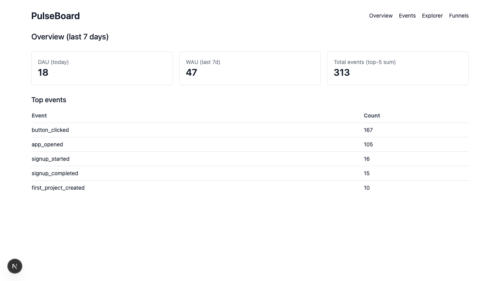
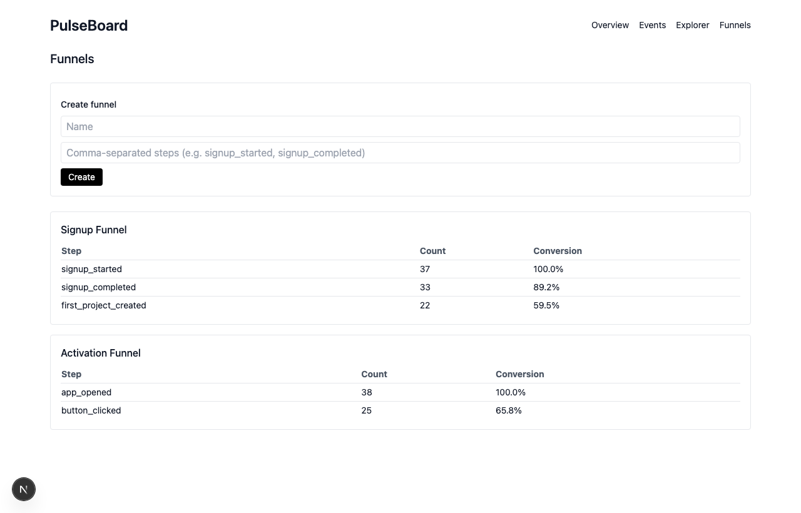
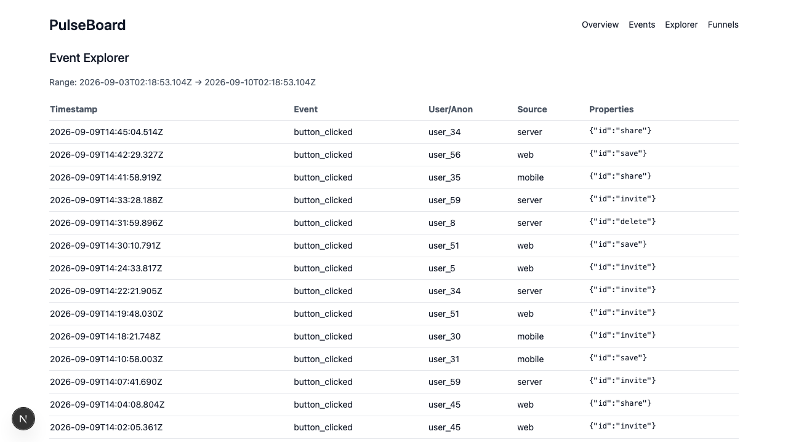

# PulseBoard — ClickHouse Analytics Dashboard (Mixpanel-lite)


A minimal, production-ish product-analytics platform: ingest events through a validated API, store them in ClickHouse (with Postgres as the config plane), and explore DAU/WAU, top events, funnels, and a raw event stream in a Next.js dashboard.



<table>
  <tr>
    <td></td>
    <td></td>
  </tr>
</table>

## Architecture

```
Node/Web SDK ──▶ POST /api/events ──▶ ┌─ Postgres (Prisma): idempotency, event defs, funnels, reports
   (typed)        Zod validation      └─ ClickHouse: raw events (source of truth)
                  + idempotency                     │
                                                    ▼
                                         Next.js dashboard: DAU/WAU · top events · funnels · explorer
```

Events are written only to ClickHouse (the analytical source of truth) while Postgres holds transactional config — ingest requests (for idempotency), event definitions, funnel configs, and saved reports. The split is deliberate: ClickHouse serves fast columnar aggregation over billions of rows; Postgres serves the relational config the app mutates.

## Quickstart

```bash
cp .env.example .env
docker compose up -d          # Postgres + ClickHouse
npm install
npm run setup                 # prisma generate + migrate + ClickHouse DDL + seed funnels
npm run dev                   # http://localhost:3000
npm run demo:seed             # generate ~30 days of realistic demo events
```

Open the dashboard and you'll see live DAU/WAU, a signup funnel with real cohort drop-off, and a browsable event stream.

## Tech

- Next.js 15 (App Router), TypeScript, Tailwind
- Prisma + Postgres
- ClickHouse (`@clickhouse/client`)
- Zod
- Vitest
- Docker Compose for local Postgres + ClickHouse

## Event Schema (ClickHouse)

Table `events` (MergeTree, partition by `toYYYYMM(timestamp)` order by `(event_name, timestamp)`):

- event_id String (UUID)
- event_name LowCardinality(String)
- timestamp DateTime64(3, 'UTC')
- user_id Nullable(String)
- anonymous_id Nullable(String)
- session_id Nullable(String)
- source LowCardinality(String)
- properties String (JSON string)
- ingest_idempotency_key Nullable(String)

## Metrics Definitions

- DAU: distinct users per day using `coalesce(user_id, anonymous_id)`
- WAU: distinct users in a 7-day window using the same coalesce

## Funnel Logic

For steps `[s1, s2, ...]` within a time range:

1. For each user (coalesced id), compute earliest timestamp per step
2. A user converts to step `i` if they have step `i` at time >= time of step `i-1`
3. Conversion per step is `count(step i) / count(step 1)`

Implemented as sequential CTEs in ClickHouse and unit-tested with a pure function.

## Manual setup

If you'd rather run the steps individually instead of `npm run setup`:

1. `cp .env.example .env`
2. `docker compose up -d` (Postgres + ClickHouse)
3. `npm install`
4. `npm run db:generate && npm run db:migrate`
5. `npm run ch:setup`
6. `npm run db:seed`
7. `npm run dev` (Next on http://localhost:3000)
8. Demo data: `npm run demo:seed`

## Required Scripts

- `dev` → `next dev`
- `db:migrate` → `prisma migrate dev`
- `db:generate` → `prisma generate`
- `db:seed` → `tsx prisma/seed.ts`
- `ch:setup` → run ClickHouse DDL
- `test` → `vitest`

## Screens (MVP)

- Overview: DAU/WAU + top events
- Events: top events table with date filters
- Explorer: raw events, filters by event/user/anon
- Funnels: list/create funnels, show conversion

## Tests

- Zod ingestion rules (IDs required, naming rules)
- Funnel correctness on synthetic dataset

Run: `npm test`

## Engineering notes

A few correctness details this project gets right, learned the hard way:

- **ClickHouse `count()` is UInt64 → JSON string.** Aggregates come back as strings over the HTTP interface; they're coerced to numbers at the query boundary so summing top-N doesn't string-concatenate.
- **`minIf(...)` over zero rows returns the epoch, not NULL.** A funnel step a user never fired would otherwise pass a `NOT NULL` check. Presence is tracked with explicit `maxIf(1, …)` flags, and step *i* requires the full ordered chain `ts1 ≤ … ≤ ts_i`.
- **Client config.** `@clickhouse/client` 0.2.x takes `host` (a full URL), not `url` — the wrong key silently falls back to `localhost:8123`.

CI (`.github/workflows/ci.yml`) runs typecheck, unit tests, and a production build against a Postgres service container on every push.

## Scaling Notes

- Materialized views for common aggregates
- Further partitioning by event_name, or TTL for old partitions
- Batching inserts on ingest
- Consider `JSON`/`Object('json')` for typed properties with constraints

## Acceptance Criteria (MVP)

- `docker compose up` starts Postgres + ClickHouse cleanly
- `POST /api/events` accepts events and writes to ClickHouse
- Duplicate `idempotencyKey` returns `duplicate` and does not double insert
- Overview shows DAU/WAU + top events for a date range
- Event Explorer shows raw events with filters
- Funnels can be created and show conversion stats
- Seed/demo generator creates enough activity to make charts meaningful
- Tests pass (`npm test`)
